## Assignment-1:- Containerized Web Application with PostgreSQL using Docker Compose and Macvlan/Ipvlan

<hr>

<h4 align="center"> Pre-requisite </h4>

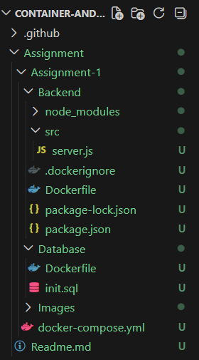

<hr>

**Step-1:- Initialize a Node Package**
```bash
npm init -y
```
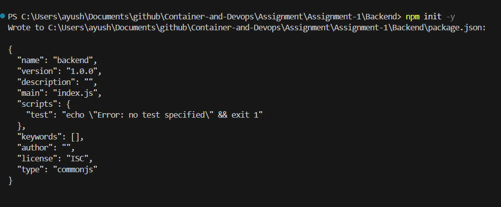


**Step-2:- Install Necessary Package**
```bash
npm i express pg
```
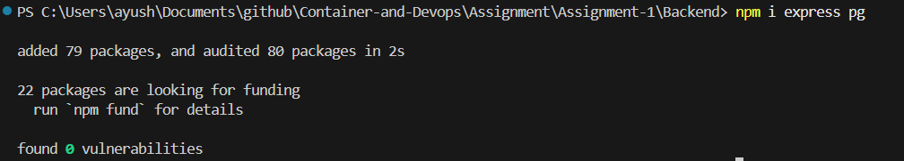


**Step-3:- The `package.json` will look as follows:-**
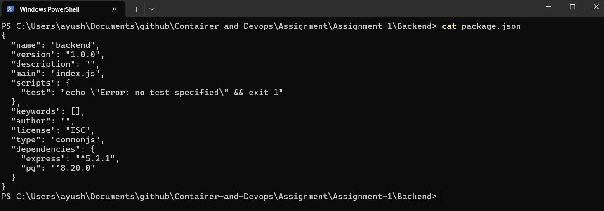


**Step-4:- The `server.js` will look as follows:-**
```js
const express = require("express");
const { Pool } = require("pg");


const app = express();
app.use(express.json());

const pool = new Pool({
  host: process.env.DB_HOST,
  user: process.env.POSTGRES_USER,
  password: process.env.POSTGRES_PASSWORD,
  database: process.env.POSTGRES_DB,
  port: 5432
});

async function initDB() {
  await pool.query(`
    CREATE TABLE IF NOT EXISTS users(
        id SERIAL PRIMARY KEY,
        name TEXT
    )
  `);
}

initDB();

app.get("/health", (req, res) => {
  res.send("Server healthy");
});

app.post("/users", async (req, res) => {
  const { name } = req.body;

  const result = await pool.query(
    "INSERT INTO users(name) VALUES($1) RETURNING *",
    [name]
  );

  res.json(result.rows[0]);
});

app.get("/users", async (req, res) => {
  const result = await pool.query("SELECT * FROM users");
  res.json(result.rows);
});

app.listen(3000, "0.0.0.0", () => {
  console.log("Server running on port 3000");
});
```
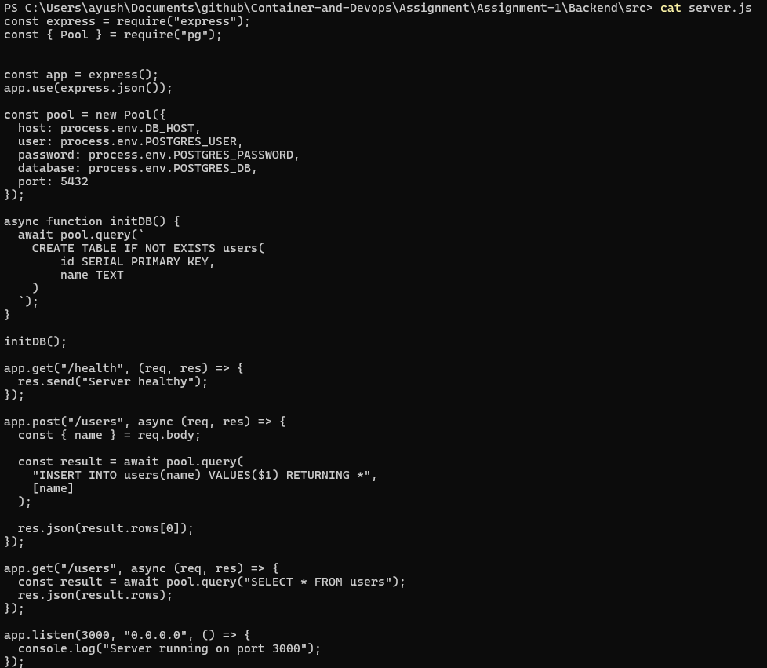


**Step-5:- The backend/`Dockerfile` will look as follows:-**
```Dockerfile
# Builder Stage
FROM node:20-alpine AS builder

WORKDIR /app

COPY package*.json ./

RUN npm install --only=production

COPY . .

# Runtime Stage
FROM node:20-alpine

WORKDIR /app

RUN addgroup -S appgroup && adduser -S appuser -G appgroup

COPY --from=builder /app .

USER appuser

EXPOSE 3000

CMD ["node", "src/server.js"]
```
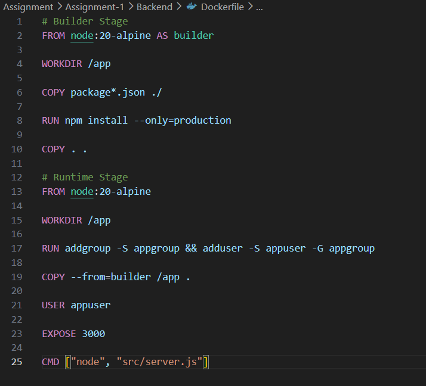


**Step-6:- The `.dockerignore` will look as follows:-**
```bash
node_modules
npm-debug.log
Dockerfile
.git
.gitignore
````
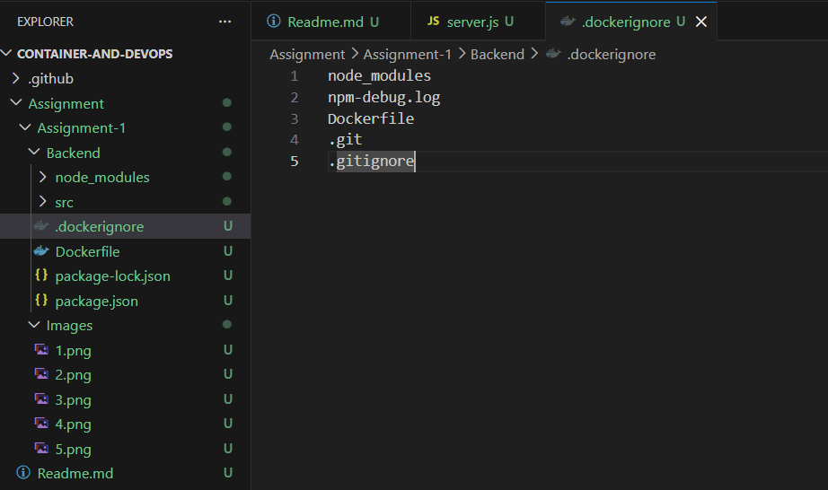


**Step-7:- The database/`Dockerfile` will look as follows:-**
```Dockerfile
FROM postgres:15-alpine

COPY init.sql /docker-entrypoint-initdb.d/
```
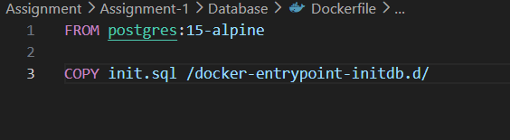


**Step-8:- The `init.sql` will look as follows:-**
```sql
CREATE TABLE IF NOT EXISTS users(
    id SERIAL PRIMARY KEY,
    name TEXT
);
```
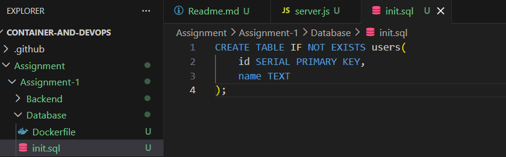


**Step-9:- The `docker-compose.yml` will look as follows:-**
```docker-compose
version: "3.9"

services:

  database:
    build: ./database
    container_name: postgres_db
    restart: always
    environment:
      POSTGRES_DB: mydb
      POSTGRES_USER: admin
      POSTGRES_PASSWORD: ayush
    volumes:
      - pgdata:/var/lib/postgresql/data
    networks:
      - mynet
    healthcheck:
      test: ["CMD-SHELL", "pg_isready -U admin -d mydb"]
      interval: 10s
      retries: 5

  backend:
    build: ./backend
    container_name: node_backend
    ports:
    - "3000:3000"  
    restart: always
    environment:
      DB_HOST: postgres_db   
      POSTGRES_DB: mydb
      POSTGRES_USER: admin
      POSTGRES_PASSWORD: ayush
    depends_on:
      database:
        condition: service_healthy
    networks:
      - mynet

volumes:
  pgdata:

networks:
  mynet:
    driver: bridge
```
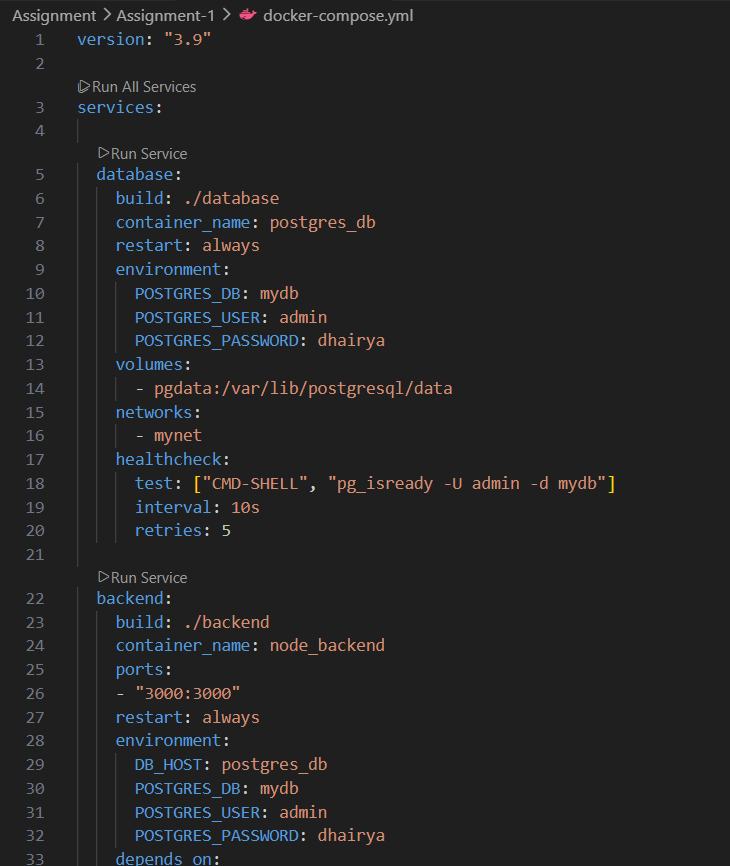


**Step-10:- Find your interface**
```bash
ip a
```
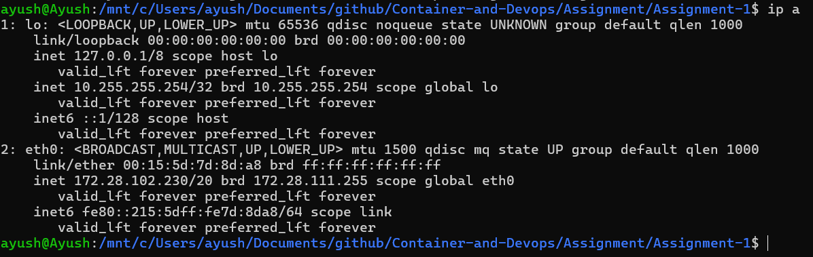


**Step-11:- Create Network**
```bash
docker network create -d macvlan \
  --subnet=192.168.50.0/24 \
  --gateway=192.168.50.1 \
  -o parent=eth0 \
  macvlan_net
```
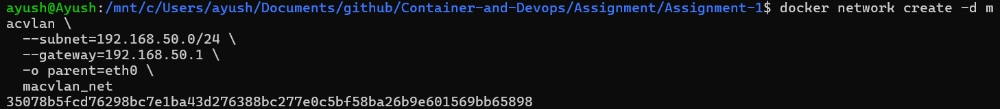


**Step-12:- Build from Compose**
```bash
docker-compose up build --no-cache
```
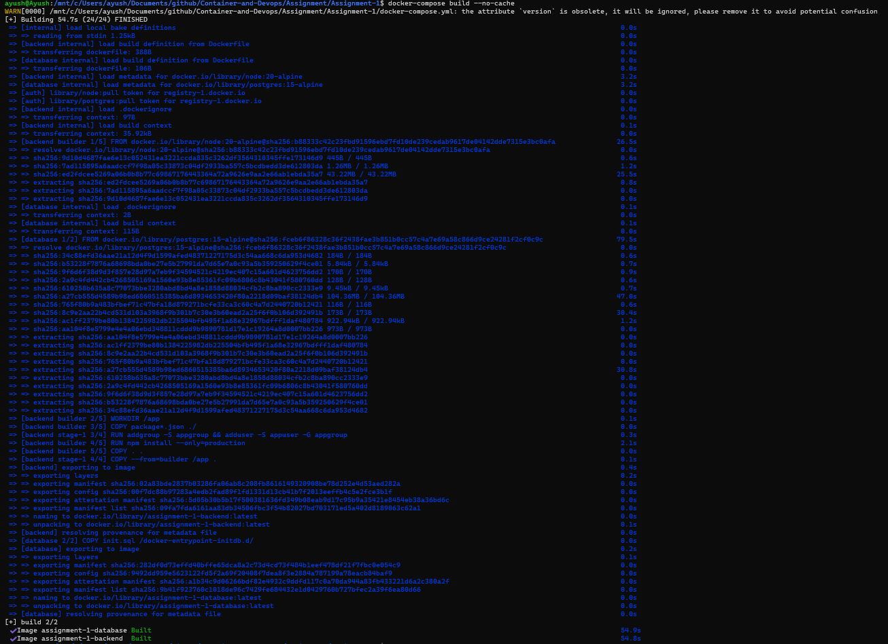


**Step-13:- Start Services**
```bash
docker-compose up -d
```
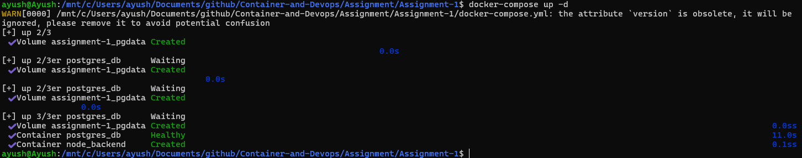


**Step-14:- Insert A User in DB in API**
```bash
curl -X POST http://localhost:3000/users \
-H "Content-Type: application/json" \
-d '{"name":"Ayush"}'
```
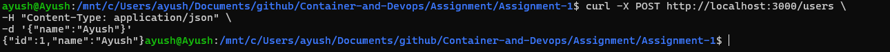


**Step-15:- GET User API**
```bash
curl http://192.168.50.20:3000/users
```
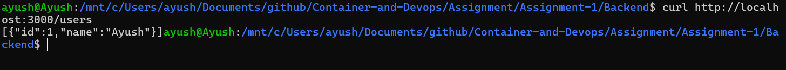


**Step-16:- List Running Container**
```bash
docker ps
```
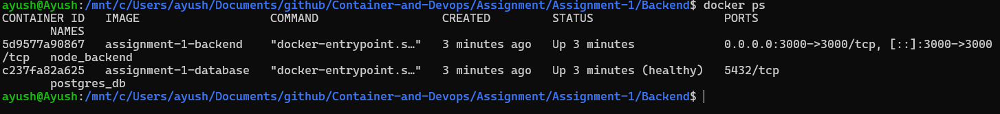


**Step-17:- List Volumes**
```bash
docker volume ls 
```
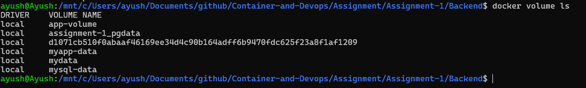


**Step-18:- Inspect Network**
```bash
docker network inspect macvlan_net
```
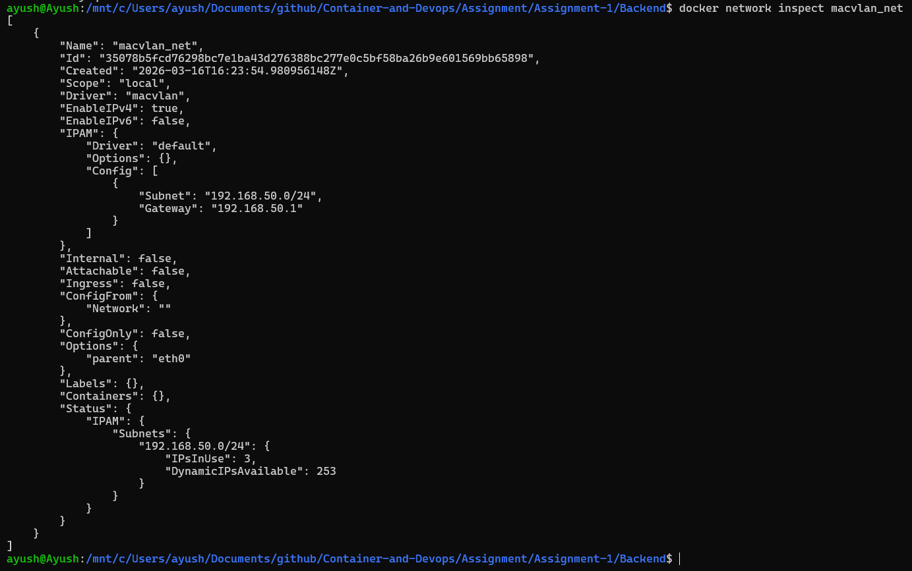


**Step-19:- Inspect Backend Container**
```bash
docker inspect node_backend
```
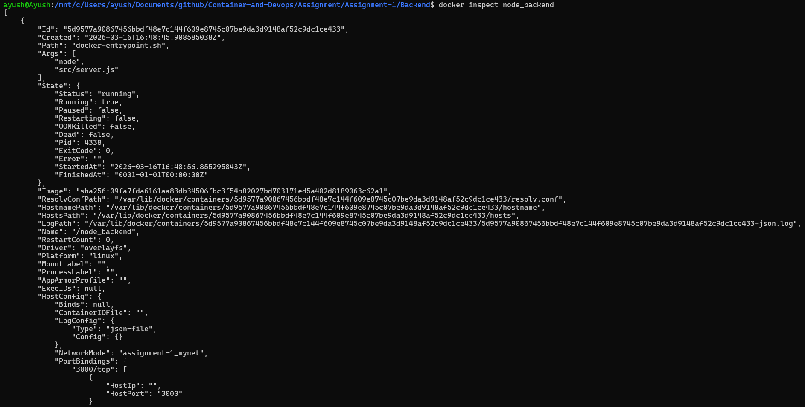


**Step-20:- Inspect DB**
```bash
docker inspect postgres_db
```
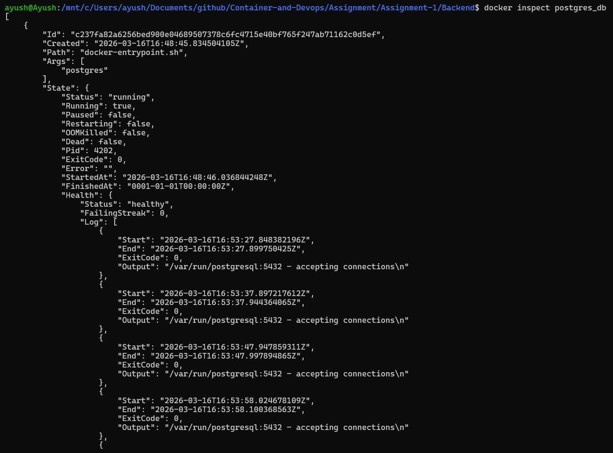


**Step-21:- Verify Data Persistence**
This step will verify that data stored in DB is permanently saved irrespective of the state of the container.
```bash
docker-compose down
docker-compose up -d
curl http://192.168.50.20:3000/users
```
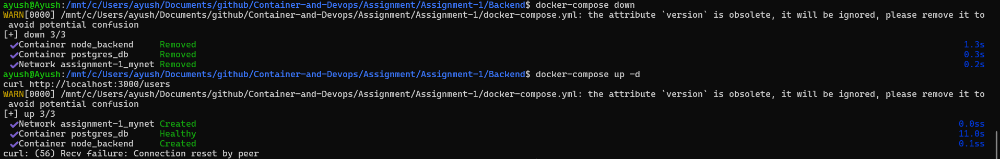


<hr>

<h4 align="center"> Conclusion </h4>

<hr>

## Build Optimization

The Docker images were optimized for efficiency, security, and minimal size using the following techniques:

### 1. Multi-Stage Build
The backend Dockerfile uses a multi-stage build — dependencies are installed in a **builder stage**, and only the necessary files are copied to the final **runtime stage**. This keeps the final image clean and small by excluding build tools and unnecessary files.

### 2. Minimal Base Image
Instead of the full Node.js image, `node:20-alpine` was used. Alpine Linux is extremely lightweight, which results in:
- Smaller image size
- Faster downloads
- Quicker container startup

### 3. .dockerignore File
A `.dockerignore` file was used to exclude files like `node_modules`, `.git`, and log files from the build context. This speeds up the build process and prevents unwanted files from ending up in the image.

### 4. Non-Root User
The container runs as a **non-root user**, reducing security risks in case the application is ever compromised.

<br>

**_Network Design Diagram_**

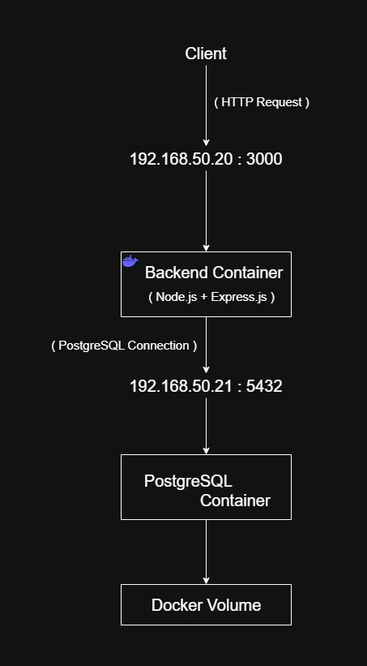


<br>


## Image Size Comparison

The choice of base image significantly affects the final Docker image size:

| Base Image | Size |
|------------|------|
| `node:20` | ~1.1 GB |
| `node:20-alpine` | ~180 MB |

The Alpine-based image is **6x smaller** than the standard Node.js image, which means:
- Less storage usage
- Faster image downloads
- Quicker container startup time

For these reasons, `node:20-alpine` was chosen as the base image for this project.

---

## Macvlan vs IPvlan

| Feature | MACVLAN | IPVLAN |
|---------|---------|--------|
| MAC Addresses | One per container | One shared for all |
| Network Switch Load | Higher (learns many MACs) | Lower (one MAC) |
| Scalability | Limited by switch | Much higher |
| Best For | Small deployments | Large-scale deployments |
