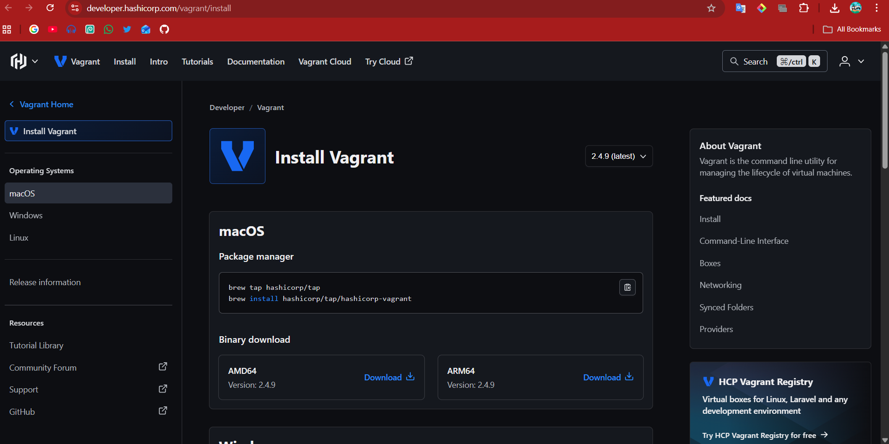
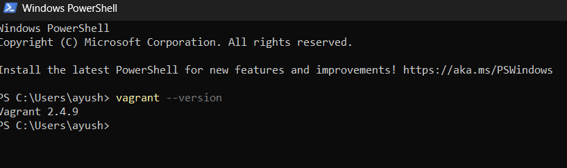
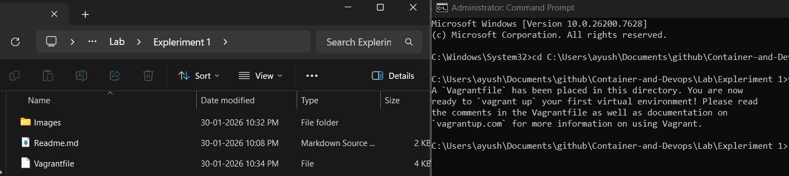
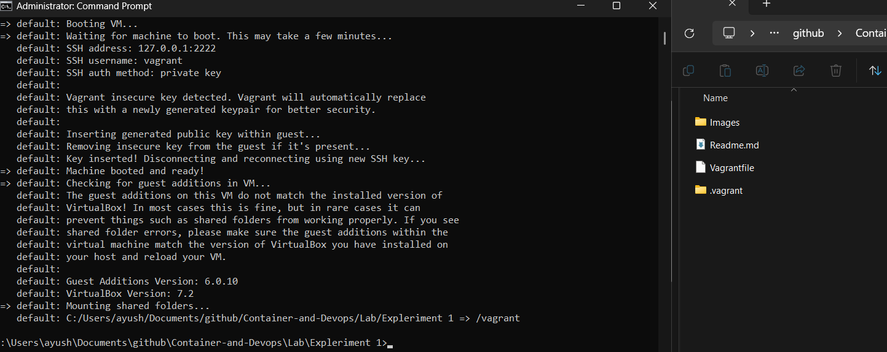
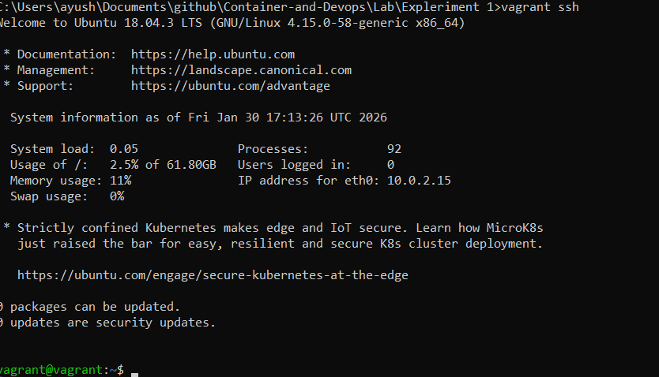
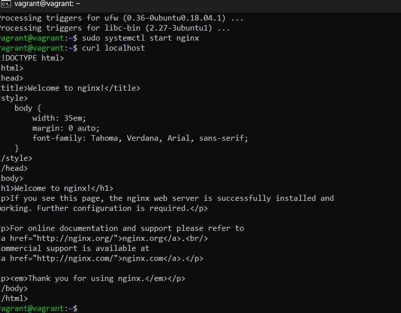
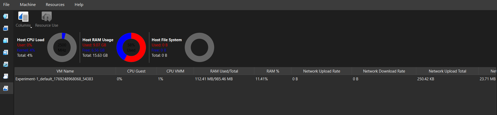
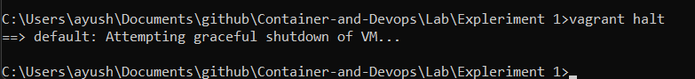
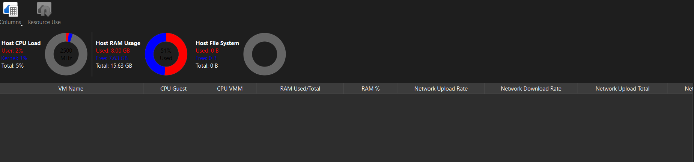

# Experiment 1: Comparision of VMs and Containers using Ubuntu and Nginx

## Part A: Virtual Machine Windows


Download Virtual Box from [here](https://www.virtualbox.org/wiki/Downloads)


Download Vagrant from [here](https://developer.hashicorp.com/vagrant/install)



To verify the installation we will check the version via following command
```
vagrant --version
```



Initialize Vagrant with Ubuntu box:
```
vagrant init hashicorp/bionic64
```



Start the VM:
```
vagrant up
```



Access the VM:
```
vagrant ssh
```



Step 4: Install Nginx inside VM
```
sudo apt update
sudo apt install -y nginx
sudo systemctl start nginx
```


Verify Nginx
```
curl localhost
``` 



Utilization Matrix In Running State



Stop VM
```
vagrant halt
```



Utilization Matrix In Stop State



Remove VM
```
vagrant destroy
```


# Experiment Setup - Part B: Containers using WSL (Windows)

**Topic:** Setting up Docker containers using Windows Subsystem for Linux  
**Objective:** Install and configure Docker on WSL2, run containers, and compare resource utilization


## Step 1: Install WSL 2

Install Windows Subsystem for Linux version 2.

```bash
wsl --install
```

**Important:** Reboot the system after installation.


## Step 2: Install Ubuntu on WSL

Install Ubuntu distribution on WSL.

```bash
wsl --install -d Ubuntu
```

This will download and install the Ubuntu distribution for WSL.


## Step 3: Install Docker Engine inside WSL

Once Ubuntu is running in WSL, install Docker Engine with the following commands:

```bash
sudo apt update
sudo apt install -y docker.io
sudo systemctl start docker
sudo usermod -aG docker $USER
```

### Command Explanation:
- `sudo apt update` - Updates package lists
- `sudo apt install -y docker.io` - Installs Docker engine
- `sudo systemctl start docker` - Starts Docker service
- `sudo usermod -aG docker $USER` - Adds current user to docker group (run without sudo)

**Important:** Logout and login again to apply group changes.


## Step 4: Run Ubuntu Container with Nginx

Pull the Ubuntu image and run an Nginx container.

```bash
docker pull ubuntu

docker run -d -p 8080:80 --name nginx-container nginx
```

### Command Breakdown:
- `docker pull ubuntu` - Downloads the Ubuntu image from Docker Hub
- `docker run` - Creates and starts a new container
  - `-d` - Run in detached mode (background)
  - `-p 8080:80` - Map host port 8080 to container port 80
  - `--name nginx-container` - Name the container
  - `nginx` - Use the nginx image


## Step 5: Verify Nginx in Container

Test if Nginx is running and accessible.

```bash
curl localhost:8080
```

You should see the Nginx welcome page HTML output. This confirms that:
- Container is running successfully
- Port mapping is working correctly
- Nginx web server is accessible

---


### VM Observation Commands

Monitor system resources on the Virtual Machine:

```bash
free -h          # Memory usage
htop             # Interactive process viewer
systemd-analyze  # Boot time analysis
```

### Container Observation Commands

Monitor Docker container resources:

```bash
docker stats     # Real-time container resource usage
free -h          # Host memory usage
```

---

## VM vs Container Comparison

### Parameters to Compare

| Parameter | Virtual Machine | Container |
|-----------|----------------|-----------|
| **Boot Time** | High | Very Low |
| **RAM Usage** | High | Low |
| **CPU Overhead** | Higher | Minimal |
| **Disk Usage** | Larger | Smaller |
| **Isolation** | Strong | Moderate |

### Key Differences Explained:

####  Boot Time
- **VM:** Takes minutes to boot (full OS initialization)
- **Container:** Starts in seconds (shares host kernel)

####  RAM Usage
- **VM:** Allocates fixed memory (even if unused)
- **Container:** Uses only what's needed, dynamic allocation

####  CPU Overhead
- **VM:** Hardware virtualization overhead
- **Container:** Near-native performance (no hypervisor layer)

####  Disk Usage
- **VM:** Full OS installation (GBs)
- **Container:** Only application + minimal dependencies (MBs)

####  Isolation
- **VM:** Complete isolation (separate kernel)
- **Container:** Process-level isolation (shared kernel)


##  Useful Docker Commands

```bash
# List running containers
docker ps

# List all containers (including stopped)
docker ps -a

# Stop a container
docker stop nginx-container

# Start a stopped container
docker start nginx-container

# Remove a container
docker rm nginx-container

# View container logs
docker logs nginx-container

# Execute command in running container
docker exec -it nginx-container bash

# View resource usage
docker stats nginx-container
```


##  Conclusion

This experiment demonstrates the practical setup of Docker containers on Windows using WSL2. The comparison between VMs and containers highlights the efficiency and lightweight nature of containerization, making it ideal for modern application deployment and development workflows.

**Key Takeaway:** Containers provide faster deployment, better resource utilization, and easier scalability compared to traditional virtual machines while maintaining adequate isolation for most use cases.
